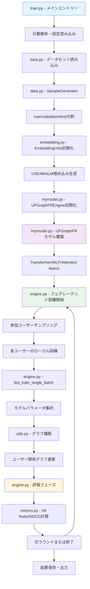

# UFGraphFR: Universal Feature Graph for Federated Recommendation

**UFGraphFR (Universal Feature Graph for Federated Recommendation)** は機械学習の推薦システムにおいて、フェデレーテッドラーニングとグラフニューラルネットワークを組み合わせた先進的なモデルです。

オリジナルのリポジトリ：https://github.com/trueWangSyutung/UFGraphFR

## 🚀 クイックスタート（新規開発者向け）

### 最初に読むべきファイル

新規開発・リファクタリングに関わる方は、以下の順序でファイルを確認することをお勧めします：

1. **`train.py`** - メインエントリーポイント、実行の起点
2. **`mymodel.py`** - コアモデル実装（UFGraphFR、Transformer、MLP）
3. **`engine.py`** - 訓練・評価エンジン、フェデレーテッドラーニングロジック
4. **`data.py`** - データローダー、前処理ロジック
5. **`utils.py`** - ユーティリティ関数、グラフ構築
6. **`embedding.py`** - ユーザー・アイテム埋め込み処理
7. **`metrics.py`** - 評価指標（Hit Ratio、NDCG）

## 📊 システム処理フロー



## 🏗️ アーキテクチャ概要

### コアコンポーネント

#### 1. **モデル層** (`mymodel.py`)
- **UFGraphFR**: メインの推薦モデル
- **TransformerBlockKan**: マルチヘッドアテンション機構
- **CommonMLP**: 共通MLP層
- **MultiheadAttention**: カスタムアテンション実装

#### 2. **エンジン層** (`engine.py`)
- **Engine**: 基底訓練・評価エンジン
- フェデレーテッドラーニングロジック
- クライアント-サーバー間のパラメータ集約

#### 3. **データ層** (`data.py`)
- **SampleGenerator**: データ分割・負例サンプリング
- **UserItemRatingDataset**: PyTorchデータセット

#### 4. **埋め込み層** (`embedding.py`)
- **EmbeddingUtils**: テキスト埋め込み生成
- Universal Sentence Encoder (USE)
- MiniLM-L6サポート

## 📋 主要設定パラメータ

| パラメータ | デフォルト値 | 説明 |
|-----------|-------------|------|
| `--alias` | UFGraphFR | モデル名 |
| `--dataset` | 100k | データセット選択 |
| `--latent_dim` | 32 | 潜在次元数 |
| `--batch_size` | 256 | バッチサイズ |
| `--lr` | 0.1 | 学習率 |
| `--num_round` | 100 | フェデレーテッドラウンド数 |
| `--use_transfermer` | True | Transformer使用フラグ |
| `--use_jointembedding` | True | 結合埋め込み使用フラグ |
| `--use_cuda` | False | CUDA使用フラグ |
| `--use_mps` | False | MPS (Apple Silicon) 使用フラグ |

## 🔧 セットアップ

### 必要な依存関係

```bash
# Poetry使用の場合
poetry install

# pipの場合
pip install -r requirements.txt
```

### 主要依存関係
- PyTorch 2.3.0+
- MediaPipe 0.10.15+
- pandas 2.2.2+
- scikit-learn 1.5.1+
- sentence-transformers 3.2.1+

## 🏃 実行方法

### 基本実行
```bash
python train.py --dataset 100k --num_round 50
```

### GPU使用
```bash
python train.py --use_cuda True --device_id 0
```

### Apple Silicon (MPS) 使用
```bash
python train.py --use_mps True
```

### カスタム設定
```bash
python train.py \
    --dataset ml-1m \
    --latent_dim 64 \
    --batch_size 512 \
    --lr 0.01 \
    --num_round 100 \
    --use_transfermer True \
    --use_jointembedding True
```

## 📁 データセット構造

サポートされているデータセット：
- `100k`: MovieLens 100K
- `ml-1m`: MovieLens 1M  
- `lastfm-2k`: Last.fm 2K
- `hetres-2k`: HetRec 2K
- `amazon`: Amazon reviews
- `douban`: Douban

データ形式：
```
data/
├── 100k/
│   ├── ratings.dat
│   ├── u.item
│   └── u.user
├── ml-1m/
│   ├── ratings.dat
│   └── u.user
└── ...
```

## ⚡ パフォーマンス最適化

### GPU使用時の推奨設定
```bash
python train.py --use_cuda True --batch_size 512 --lr 0.01
```

### メモリ効率化
```bash
python train.py --batch_size 128 --latent_dim 16
```

## 🧪 評価指標

- **Hit Ratio@K**: トップK推薦における命中率
- **NDCG@K**: 正規化割引累積利得
- デフォルト: K=10

## 🔍 デバッグ・開発のヒント

### 1. ログ出力の確認
```python
# engine.py内でのデバッグ
print(f"Round {round_id}, User {user}, Loss: {loss.item()}")
```

### 2. モデル構造の確認
```python
# mymodel.py内で
print(self.model)  # モデル構造を出力
```

### 3. データ形状の確認
```python
# data.py内で
print(f"Train: {len(train)}, Val: {len(val)}, Test: {len(test)}")
```

## 📚 さらなる詳細

### 関連論文・参考文献

### ライセンス
Open Academic Community License V1

### 開発者向け注意事項
- 型アノテーションを厳密に記述
- NumPy形式のdocstringを使用
- モジュール間の結合度を最小化
- Pydanticまたはdataclassを活用

---

💡 **開発時のTips**: 新しい機能を追加する際は、まず`mymodel.py`でモデルアーキテクチャを確認し、`engine.py`で訓練ロジックを理解してから実装することをお勧めします。


