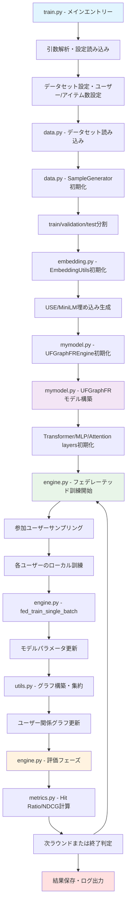

# UFGraphFR: Universal Feature Graph for Federated Recommendation

**UFGraphFR (Universal Feature Graph for Federated Recommendation)** は機械学習の推薦システムにおいて、フェデレーテッドラーニングとグラフニューラルネットワークを組み合わせた先進的なモデルです。

オリジナルのリポジトリ：https://github.com/trueWangSyutung/UFGraphFR

## 🚀 クイックスタート（新規開発者向け）

### 最初に読むべきファイル

新規開発・リファクタリングに関わる方は、以下の順序でファイルを確認することをお勧めします：

1. **`train.py`** - メインエントリーポイント、コマンドライン引数解析、実行フロー制御
2. **`mymodel.py`** - コアモデル実装（UFGraphFR、UFGraphFREngine、Transformer、MLP）
3. **`engine.py`** - 基底エンジンクラス、フェデレーテッドラーニングロジック、訓練・評価処理
4. **`data.py`** - データローダー、SampleGenerator、前処理ロジック
5. **`embedding.py`** - EmbeddingUtils、ユーザー・アイテム埋め込み処理（USE/MiniLM）
6. **`utils.py`** - ユーティリティ関数、グラフ構築、デバイス設定
7. **`metrics.py`** - 評価指標（Hit Ratio、NDCG）の計算処理

## 📊 システム処理フロー



### 詳細な処理フロー説明

1. **初期化フェーズ** (`train.py`)
   - コマンドライン引数の解析
   - データセット固有の設定（ユーザー数、アイテム数）
   - モデルエンジンの選択（UFGraphFREngine or MLPEngine）

2. **データ準備フェーズ** (`data.py`, `embedding.py`)
   - データセット読み込み（ratings.dat, u.user等）
   - ユーザー・アイテムIDの再インデックス
   - 埋め込み生成（Universal Sentence Encoder/MiniLM）

3. **訓練ループ** (`engine.py`)
   - 各ラウンドで参加ユーザーをサンプリング
   - ローカル訓練の実行
   - パラメータ集約とグラフ更新

4. **評価・検証** (`metrics.py`)
   - Hit Ratio@10とNDCG@10の計算
   - 最良結果の記録とログ出力

## 🏗️ アーキテクチャ概要

### コアコンポーネント

#### 1. **モデル層** (`mymodel.py`)
- **UFGraphFR**: メインの推薦モデル
  - ユーザー埋め込み（Linear/Embedding）
  - アイテム埋め込み（Embedding）
  - マルチヘッドアテンション（TransformerBlockKan）
  - MLP層（CommonMLP）
- **TransformerBlockKan**: マルチヘッドアテンション機構
- **CommonMLP**: 共通MLP層
- **MultiheadAttention**: カスタムアテンション実装
- **UFGraphFREngine**: エンジンクラス（Engineを継承）

#### 2. **エンジン層** (`engine.py`)
- **Engine**: 基底訓練・評価エンジン
  - `fed_train_a_round()`: フェデレーテッドラウンド実行
  - `fed_train_single_batch()`: バッチ単位の訓練
  - `fed_evaluate()`: 評価処理
  - `aggregate_clients_params()`: パラメータ集約
- フェデレーテッドラーニングロジック
- クライアント-サーバー間のパラメータ集約

#### 3. **データ層** (`data.py`)
- **SampleGenerator**: データ分割・負例サンプリング
  - `store_all_train_data()`: 訓練データ生成
  - `validate_data/test_data`: 検証・テストデータ
- **UserItemRatingDataset**: PyTorchデータセット
  - ユーザー、アイテム、評価のテンソル化

#### 4. **埋め込み層** (`embedding.py`)
- **EmbeddingUtils**: テキスト埋め込み生成
  - `embedding_users()`: ユーザー特徴の埋め込み
  - Universal Sentence Encoder (USE)サポート
  - MiniLM-L6サポート
  - ユーザー情報のテキスト変換・埋め込み

#### 5. **ユーティリティ層** (`utils.py`)
- デバイス設定（CUDA/MPS）
- グラフ構築関数
- 正則化計算
- チェックポイント管理

#### 6. **評価層** (`metrics.py`)
- **MetronAtK**: Top-K評価指標
  - Hit Ratio@K計算
  - NDCG@K計算

## 📋 主要設定パラメータ

| パラメータ | デフォルト値 | 説明 |
|-----------|-------------|------|
| `--alias` | UFGraphFR | モデル名 |
| `--dataset` | 100k | データセット選択 |
| `--latent_dim` | 32 | 潜在次元数 |
| `--batch_size` | 256 | バッチサイズ |
| `--lr` | 0.1 | 学習率 |
| `--num_round` | 100 | フェデレーテッドラウンド数 |
| `--use_transfermer` | True | Transformer使用フラグ |
| `--use_jointembedding` | True | 結合埋め込み使用フラグ |
| `--use_cuda` | False | CUDA使用フラグ |
| `--use_mps` | False | MPS (Apple Silicon) 使用フラグ |

## 🔧 セットアップ

### 必要な依存関係

```bash
# Poetry使用の場合
poetry install

# pipの場合
pip install -r requirements.txt
```

### 主要依存関係
- PyTorch 2.3.0+
- MediaPipe 0.10.15+
- pandas 2.2.2+
- scikit-learn 1.5.1+
- sentence-transformers 3.2.1+

## 🏃 実行方法

### Macでローカルで実行する場合
```bash
poetry run python train.py --use_mps True --batch_size 128 --latent_dim 16 --pre_model MiniLM-L6 --embed_dim 384 --layers "32, 16, 8"
```

### 基本実行
```bash
python train.py --dataset 100k --num_round 50
```

### GPU使用
```bash
python train.py --use_cuda True --device_id 0
```

### Apple Silicon (MPS) 使用
```bash
python train.py --use_mps True
```

### カスタム設定
```bash
python train.py \
    --dataset ml-1m \
    --latent_dim 64 \
    --batch_size 512 \
    --lr 0.01 \
    --num_round 100 \
    --use_transfermer True \
    --use_jointembedding True
```

## 📁 データセット構造

サポートされているデータセット：
- `100k`: MovieLens 100K
- `ml-1m`: MovieLens 1M  
- `lastfm-2k`: Last.fm 2K
- `hetres-2k`: HetRec 2K
- `amazon`: Amazon reviews
- `douban`: Douban

データ形式：
```
data/
├── 100k/
│   ├── ratings.dat
│   ├── u.item
│   └── u.user
├── ml-1m/
│   ├── ratings.dat
│   └── u.user
└── ...
```

## ⚡ パフォーマンス最適化

### GPU使用時の推奨設定
```bash
python train.py --use_cuda True --batch_size 512 --lr 0.01
```

### メモリ効率化
```bash
python train.py --batch_size 128 --latent_dim 16
```

## 🧪 評価指標

- **Hit Ratio@K**: トップK推薦における命中率
- **NDCG@K**: 正規化割引累積利得
- デフォルト: K=10

## 🔍 デバッグ・開発のヒント

### 1. 主要な開発ポイント

#### モデル実装の確認ポイント (`mymodel.py`)
```python
# UFGraphFRモデルの構造確認
print(model)  # モデル構造を出力
print(f"User embedding: {model.embedding_user}")
print(f"Item embedding: {model.embedding_item}")
```

#### 訓練プロセスのデバッグ (`engine.py`)
```python
# fed_train_a_round内でのデバッグ
print(f"Round {round_id}, Participants: {len(participants)}")
print(f"User {user}, Loss: {loss.item()}")
```

#### データ形状の確認 (`data.py`)
```python
# SampleGenerator内で
print(f"Train: {len(train_data)}, Val: {len(val_data)}, Test: {len(test_data)}")
print(f"User range: [{min_user}, {max_user}]")
```

### 2. 主要な関数・クラスの役割

#### `train.py`の主要部分
- `train(config)`: メイン訓練関数
- データセット別の設定（ml-1m, 100k, lastfm-2k等）
- コマンドライン引数の解析

#### `engine.py`の主要メソッド
- `fed_train_a_round()`: 1ラウンドの訓練実行
- `fed_train_single_batch()`: バッチ単位の訓練
- `fed_evaluate()`: 評価実行
- `aggregate_clients_params()`: パラメータ集約

#### `mymodel.py`の主要クラス
- `UFGraphFR`: メインモデル
- `UFGraphFREngine`: エンジン実装
- `TransformerBlockKan`: アテンション機構
- `CommonMLP`: MLP層

### 3. 開発時の注意点

#### フェデレーテッドラーニングの実装
- ユーザーごとのローカル訓練
- パラメータの集約処理
- グラフ構築による知識共有

#### デバイス対応
- CUDA/MPS/CPUの切り替え
- テンソルのデバイス移動
- メモリ効率の最適化

#### データ前処理
- ユーザー・アイテムIDの再インデックス
- 負例サンプリング
- 埋め込み生成

## 📚 さらなる詳細

### 関連論文・参考文献

### ライセンス
Open Academic Community License V1

### 開発者向け注意事項
- 型アノテーションを厳密に記述
- NumPy形式のdocstringを使用
- モジュール間の結合度を最小化
- Pydanticまたはdataclassを活用

---

💡 **開発時のTips**: 
- 新しい機能を追加する際は、まず`train.py`で全体の流れを把握
- `mymodel.py`でモデルアーキテクチャを確認
- `engine.py`でフェデレーテッドラーニングロジックを理解
- `data.py`でデータフローを確認してから実装することをお勧めします

🎯 **リファクタリング指針**:
- 型アノテーションを厳密に記述（Python 3.10+の新記法使用）
- NumPy形式のdocstringを使用
- モジュール間の結合度を最小化
- Pydanticまたはdataclassを活用した引数設計


